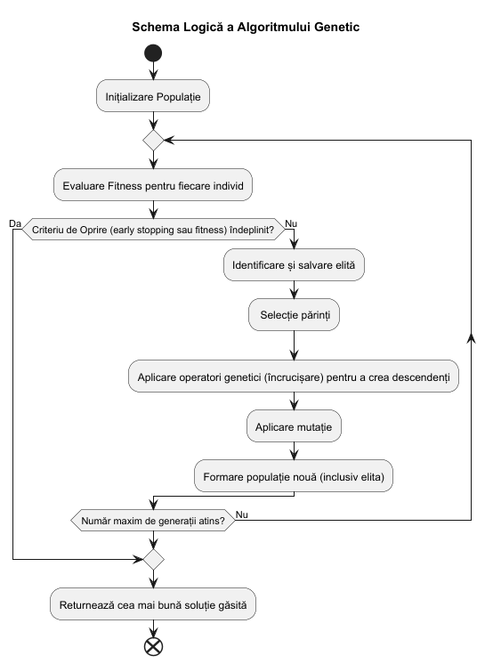

## Introducere

Algoritmii genetici (AG) reprezintă o componentă esențială a computației evolutive, fiind utilizați pe scară largă pentru rezolvarea problemelor de optimizare și căutare în spații complexe. Aceștia au fost propuși inițial de John Holland în anii '70 și se bazează pe principiile selecției naturale și geneticii, așa cum au fost descrise de Charles Darwin: "supraviețuirea celui mai adaptat".

Spre deosebire de metodele tradiționale de optimizare (precum cele bazate pe gradient), algoritmii genetici nu necesită ca funcția obiectiv să fie continuă sau derivabilă. Această caracteristică îi face extrem de robuști în fața problemelor care prezintă discontinuități sau zgomot în date. Ei operează asupra unei populații de soluții candidate, explorând simultan multiple regiuni ale spațiului de căutare, ceea ce reduce riscul de blocare în optimi locali.

## Concepte fundamentale

Un algoritm genetic manipulează o populație de "indivizi", fiecare reprezentând o soluție potențială pentru problema dată. Acești indivizi sunt adesea codificați sub formă de șiruri de simboluri (cromozomi), unde fiecare simbol reprezintă o "genă".

### Componentele algoritmului genetic

1.  **Populația:** Reprezintă setul de soluții candidate la un moment dat. Dimensiunea populației influențează direct capacitatea de explorare a spațiului de căutare.
2.  **Funcția de Fitness (Adaptare):** Este instrumentul care evaluează cât de "bună" este o soluție în raport cu obiectivul urmărit. Este singura legătură directă între algoritm și problema specifică ce trebuie rezolvată.
3.  **Cromozomul și Genele:** Reprezentarea codificată a unei soluții. În funcție de problemă, genele pot fi biți (0 sau 1), numere întregi, valori reale sau chiar permutări.

### Operatorii genetici

Evoluția populației de la o generație la alta este guvernată de trei operatori principali:

- **Selecția:** Procesul prin care sunt aleși indivizii care se vor reproduce. Metodele comune includ selecția prin turneu (Tournament Selection) sau selecția de tip ruletă (Roulette Wheel Selection). Scopul este de a oferi o șansă mai mare indivizilor mai bine adaptați (fitness mai mare).
- **Încrucișarea (Crossover):** Operatorul de recombinare care combină informația genetică a doi părinți pentru a crea descendenți (copii). Prin încrucișare, trăsăturile benefice ale părinților pot fi combinate în noi soluții superioare.
- **Mutația:** Introduce variații aleatorii în codul genetic al indivizilor. Acest operator este crucial pentru menținerea diversității genetice în cadrul populației și pentru evitarea convergenței premature către un optim local.

{#fig-ga-flow}

## Metodologie

În cadrul acestui studiu, am implementat și testat algoritmi genetici pe patru tipuri diferite de probleme, pentru a evidenția versatilitatea acestora:

1.  **Optimizarea parametrilor continui:** Găsirea parametrilor $(a, b, c)$ ai unei funcții pătratice $f(x) = ax^2 + bx + c$ pentru a minimiza curbura (obținerea unei parabole cât mai plate).
2.  **Probleme de ordonare (Sortare):** Utilizarea AG pentru a ordona o listă de numere, tratând-o ca pe o problemă de permutări.
3.  **Optimizarea hiperparametrilor în Machine Learning:** Reglarea fină a unui `DecisionTreeClassifier` pentru setul de date Pima Indians Diabetes, vizând îmbunătățirea acurateței și a curbei ROC.
4.  **Simularea mediilor dinamice (Camuflajul moliilor):** Analiza modului în care o populație se adaptează în timp real la schimbările bruște ale mediului înconjurător.

Pentru implementare, am utilizat limbajul Python, împreună cu biblioteci specializate precum `numpy` pentru calcul numeric, `matplotlib` și `seaborn` pentru vizualizare, și `scikit-learn` pentru componentele de Machine Learning.

## Rezultate și discuții

Analiza performanței algoritmilor genetici pe diversele probleme studiate a relevat următoarele aspecte:

### 1. Optimizarea funcțiilor continue

În experimentul de optimizare a parametrilor unei funcții pătratice ($ax^2 + bx + c$), algoritmul a reușit să identifice configurații care produc parabole extrem de plate, menținând totodată orientarea ramurilor în sus. Procesul de optimizare a demonstrat o convergență rapidă, cele mai bune soluții fiind identificate în primele 20 de generații. Aceasta subliniază eficiența reprezentării prin numere reale și a recombinării aritmetice în spații de căutare continue.

### 2. Sortarea prin permutări și sensibilitatea la mutație

Studiul asupra sortării numerelor ca problemă de permutări a evidențiat importanța critică a echilibrului între explorare și exploatare, gestionat prin rata de mutație. Rezultatele au arătat că: \* **Rate de mutație scăzute (0.01 - 0.08)** tind să blocheze algoritmul în optime locale, eșuând în a descoperi permutarea perfect sortată în intervalul de 200 de generații. \* **Rate de mutație optime (0.09 - 0.19)** au permis descoperirea consistentă a soluției globale. Viteza maximă de convergență a fost observată pentru rate de aproximativ 0.14-0.16, unde soluția optimă a fost găsită în mai puțin de 100 de generații.

### 3. Optimizarea hiperparametrilor în Machine Learning

Cea mai semnificativă îmbunătățire practică a fost observată în cazul clasificatorului `DecisionTree`. Comparând modelul *baseline* (configurație standard) cu cel optimizat prin algoritm genetic, s-au obținut următoarele rezultate pe setul de test:

| Metrică           | Model Baseline | Model Optimizat GA | Îmbunătățire |
|-------------------|----------------|--------------------|--------------|
| **Acuratețe**     | 0.6883         | **0.7987**         | +11.04%      |
| **Scor AUC**      | 0.7641         | **0.8248**         | +6.07%       |
| **Fals Negativi** | 40             | **15**             | -62.5%       |

Din perspectivă clinică, reducerea drastică a numărului de cazuri de diabet nediagnosticate (fals negativi) de la 40 la 15 demonstrează superioritatea modelului optimizat. Recall-ul pentru clasa pozitivă a crescut de la 0.26 la 0.72, oferind o fiabilitate mult mai mare în detecția timpurie a bolii.

## Concluzii

Prezenta lucrare a demonstrat că algoritmii genetici rămân o metodă de optimizare extrem de versatilă și robustă. Capacitatea lor de a se adapta la tipuri de date diverse (valori reale, permutări, hiperparametri discreți și continui) îi face potriviți pentru o gamă largă de aplicații inginerești și medicale.

Principalele concluzii ale studiului sunt: 1. **Flexibilitatea:** AG pot fi aplicați cu succes atât în optimizarea matematică pură, cât și în probleme complexe de inginerie a datelor. 2. **Importanța Parametrizării:** Succesul algoritmului depinde critic de alegerea corectă a operatorilor (ex: OX1 pentru permutări) și a ratelor de mutație/încrucișare. 3. **Impactul Practic:** În Machine Learning, utilizarea AG pentru *hyperparameter tuning* poate transforma un model mediocru într-unul performant, capabil să ofere rezultate cu valoare diagnostică ridicată.

Cercetările viitoare pot explora utilizarea algoritmilor hibrizi (memetici) sau a metodelor de co-evoluție pentru probleme cu dimensiuni mult mai mari ale spațiului de căutare.
