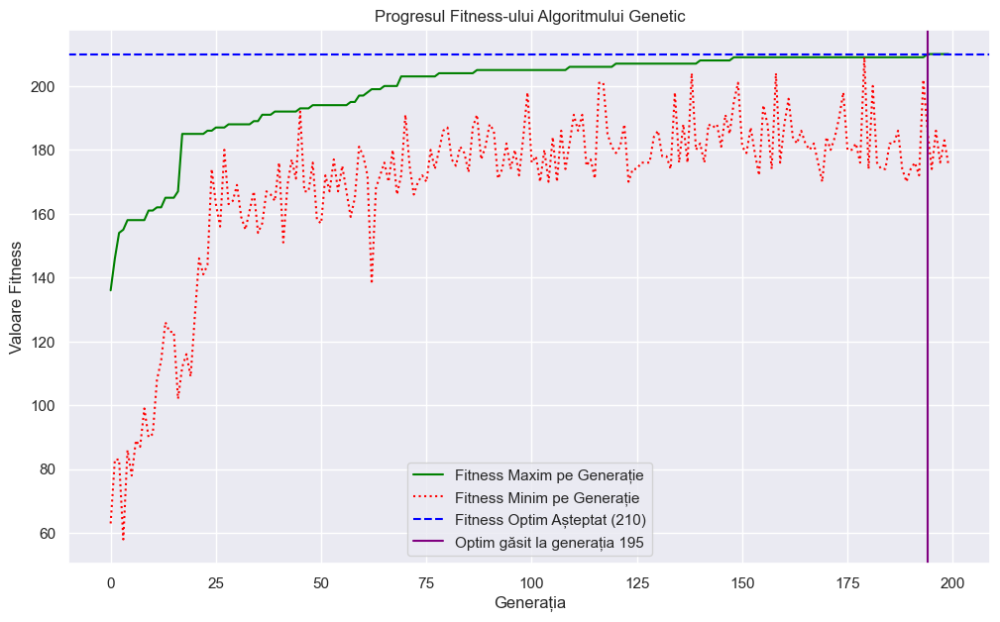
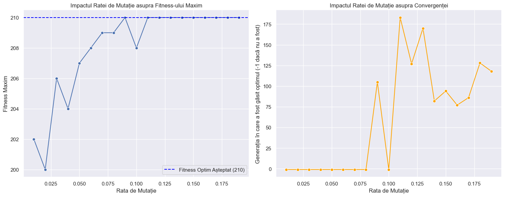
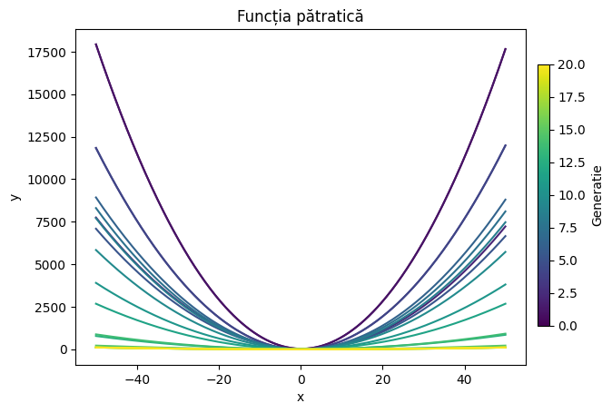
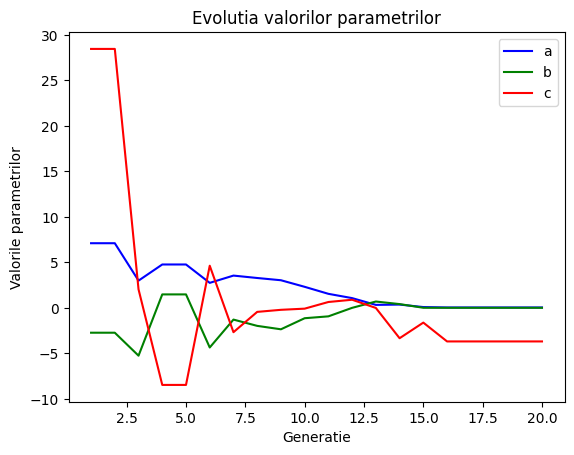
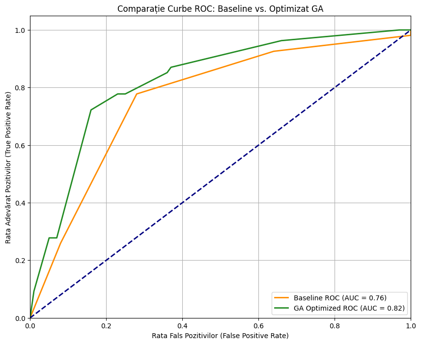
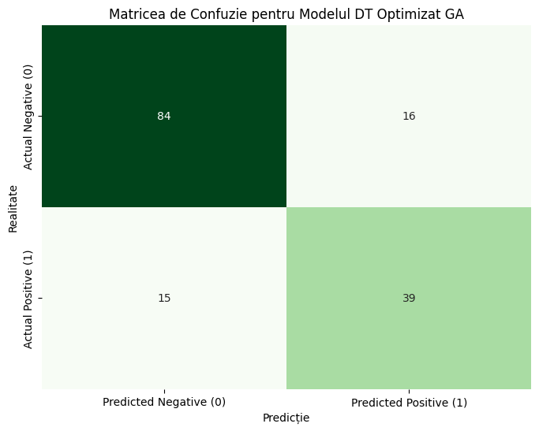

## Obiectivul prezentării

- Ce sunt algoritmii genetici
- Cum funcționează componentele lor cheie
- Unde și cum pot fi aplicați
- Ce demonstrează exemplele noastre practice

::: notes
- Scopul nu este doar să arătăm niște rezultate, ci să explicăm mecanismul din spatele lor.
- Vrem ca publicul să plece cu o imagine clară despre populație, fitness, selecție, încrucișare și mutație.
- După partea teoretică, trecem la patru aplicații diferite pentru a vedea cum se adaptează aceleași principii la probleme distincte.
:::

## De ce algoritmi genetici

- **Inspirație:** imită mecanismele selecției naturale.
- **Flexibilitate:** nu necesită ca funcția obiectiv să fie continuă sau derivabilă.
- **Explorare:** operează pe o populație de soluții, explorând simultan multiple regiuni ale spațiului de căutare.
- **Aplicabilitate:** eficienți pentru spații de căutare complexe, combinatorii sau cu zgomot în date.

::: notes
- Algoritmii genetici fac parte din calculul evolutiv.
- Spre deosebire de metodele clasice bazate pe gradient, nu cer ca funcția obiectiv să fie netedă sau derivabilă.
- Sunt utili când spațiul de căutare este mare, discret, combinatorial sau greu de modelat direct.
- Ideea centrală este că lucrăm cu o populație de soluții, nu cu o singură soluție care este îmbunătățită pas cu pas.
:::

## Ce este un algoritm genetic

Un AG manipulează o **populație** de soluții potențiale, numite **indivizi**.

- Fiecare individ este o **reprezentare** codificată a unei soluții (**cromozom**).
- Un cromozom este format din **gene**.
- Calitatea fiecărui individ este evaluată de o **funcție de fitness**.
- Populația evoluează de-a lungul mai multor **generații**.

::: notes
- Fiecare individ din populație reprezintă o soluție posibilă.
- Soluția este codificată într-un cromozom, iar componentele cromozomului sunt genele.
- Funcția de fitness spune cât de bună este soluția față de obiectivul problemei.
- De la o generație la alta, populația este evaluată, selectată și modificată prin operatori genetici.
:::

## Schema logică a algoritmului genetic

{fig-alt="Schema logică a unui algoritm genetic." width=78%}

::: notes
- Acesta este fluxul general pe care îl vom regăsi în toate exemplele.
- Începem cu o populație inițială, apoi evaluăm fiecare individ.
- Selectăm indivizii mai promițători, aplicăm încrucișare și mutație, apoi repetăm ciclul.
- Diferențele dintre exemple nu țin de existența fluxului, ci de reprezentarea cromozomului, de fitness și de operatorii aleși.
:::

## Componentele algoritmului genetic

- **Populația:** Setul de soluții candidate care explorează spațiul.
- **Funcția de Fitness:** Măsura calității unei soluții; leagă algoritmul de problemă.
- **Reprezentarea:** Modul de codificare a soluției (biți, valori reale, permutări).
- **Selecția:** Alege indivizii care se vor reproduce.
- **Încrucișarea:** Combină informația genetică a părinților.
- **Mutația:** Introduce variație nouă în populație.

::: notes
- Populația oferă diversitate și capacitate de explorare.
- Funcția de fitness este legătura directă dintre algoritm și problema concretă.
- Reprezentarea soluției este o decizie critică: biți, valori reale, permutări.
- Selecția, încrucișarea și mutația sunt mecanismele prin care evoluția este pusă în mișcare.
:::

## Selecția: idee generală

- **Scop:** Favorizează indivizii mai bine adaptați pentru a contribui la generația următoare.
- **Presiunea de selecție:** Controlează intensitatea cu care sunt favorizați cei mai buni.
  - Prea slabă -> evoluție lentă.
  - Prea puternică -> convergență prematură, pierderea diversității.
- **Metode:** Proporțională (roulette), turneu, rang.

::: notes
- Toate metodele de selecție favorizează indivizii mai buni, dar o fac în moduri diferite.
- Ideea importantă este presiunea de selecție: prea mică încetinește evoluția, prea mare distruge diversitatea.
- În exemplele noastre vom folosi frecvent turneul, dar merită să vedem pe scurt și celelalte scheme.
:::

## Selecția proporțională cu fitness-ul

Probabilitatea de selecție este direct proporțională cu fitness-ul.

$$
p_i = \frac{f_i}{\sum_{j=1}^{N} f_j}
$$

- **Avantaj:** Simplă și intuitivă.
- **Dezavantaj:** Instabilă dacă un individ are un fitness mult mai mare decât restul.

::: notes
- Aici șansa de alegere este direct proporțională cu fitness-ul.
- Este metoda cea mai intuitivă, dar poate deveni instabilă dacă un individ domină numeric toată populația.
- De aceea, în practică, multe implementări folosesc turneu sau rang.
:::

## Selecția prin turneu

- Se alege aleator un subgrup de `k` indivizi.
- Individul cu fitness maxim din subgrup este selectat.
- Presiunea de selecție crește odată cu `k`.

- **Avantaj:** Eficientă și stabilă, nu depinde de valorile absolute ale fitness-ului.
- **Dezavantaj:** Risc de pierdere a diversității dacă `k` este prea mare.

::: notes
- Turneul este foarte popular pentru că e simplu și robust.
- Parametrul important este k: dacă îl creștem, selectăm mai agresiv indivizii puternici.
- În exemplele noastre, această metodă apare pentru că oferă control bun fără să depindă de scala exactă a fitness-ului.
:::

## Selecția bazată pe rang și Elitismul

- **Selecția bazată pe rang:** Indivizii sunt selectați pe baza poziției (rangului) lor, nu a valorii fitness-ului. Reduce influența indivizilor cu fitness extrem.
- **Elitismul:** Un mecanism care copiază direct cei mai buni `e` indivizi în generația următoare. Garantează conservarea progresului.

::: notes
- Selecția pe rang reduce influența diferențelor extreme de fitness.
- Elitismul garantează că cele mai bune soluții nu se pierd accidental.
- Folosit moderat, este util; folosit agresiv, poate accelera convergența prematură.
:::

## Încrucișarea: idee generală

- **Scop:** Combină informația genetică a doi părinți pentru a produce descendenți.
- **Mecanism:** Accelerează exploatarea zonelor promițătoare din spațiul de căutare.
- **Dependență:** Tipul de operator utilizat depinde fundamental de reprezentarea cromozomului.

::: notes
- Încrucișarea este mecanismul prin care AG încearcă să combine trăsături utile.
- Totuși, forma încrucișării trebuie să respecte tipul soluției codificate.
- Aici se vede clar că nu există o rețetă universală.
:::

## Single-point, multi-point, uniform

:::: {.columns}
::: {.column width="50%"}
- **Single-point:**
  `111|000` + `000|111` -> `111111`
- **Multi-point:** Schimbă segmentul central.
- *Potrivite pentru păstrarea blocurilor de gene.*
:::
::: {.column width="50%"}
- **Uniform:**
  - `P1 = 111111`, `P2 = 000000`
  - Mască aleatoare: `101100`
  - Copil: `101100`
- *Amestecare genetică ridicată.*
:::
::::

::: notes
- Single-point și multi-point păstrează segmente continue din părinți.
- Uniforma decide genă cu genă ce se moștenește.
- Primele sunt mai structurale; ultima amestecă mai agresiv informația genetică.
:::

## Recombinarea aritmetică

Utilizată pentru cromozomi cu **valori reale**. Copilul este o combinație liniară a părinților.

$$
C_1 = \alpha P_1 + (1-\alpha) P_2
$$

- **Context:** Probleme de optimizare în spații continue.
- **Efect:** Produce soluții intermediare naturale între părinți.

::: notes
- Acest operator are sens doar când genele sunt valori numerice cu semnificație continuă.
- Copilul este o combinație ponderată a părinților, deci obținem soluții intermediare naturale.
- De aceea îl folosim în exemplul cu optimizarea parametrilor continui.
:::

## OX1 pentru permutări

Operator specializat pentru cromozomi de tip **permutare**.

1. Se copiază un segment din părintele 1.
2. Se completează restul cu elemente din părintele 2, în ordinea lor, ignorând duplicatele.

- **Scop:** Păstrează validitatea permutării (fiecare element apare o singură dată).

::: notes
- OX1 este important pentru că păstrează validitatea unei permutări.
- Asta înseamnă că nu pierdem elemente și nu introducem duplicate.
- Este operatorul potrivit atunci când ordinea contează, cum este în problema de sortare.
:::

## Mutația și diversitatea

- **Rol:** Introduce variație nouă în populație, prevenind stagnarea.
- **Echilibru:** Selecția **exploatează** soluțiile bune, mutația **explorează** zone noi.
- **Rata de mutație ($p_m$):**
  - $p_m$ prea mică -> convergență prematură.
  - $p_m$ prea mare -> căutare aproape aleatorie.

::: notes
- Mutația are rolul de a menține deschis spațiul de căutare.
- Fără ea, populația tinde să se omogenizeze și să stagneze.
- În funcție de reprezentare, mutația are forme diferite: inversare de bit, perturbație numerică, interschimbare de poziții.
:::

## Alegerea operatorilor după reprezentare

:::: {.columns}
::: {.column width="52%"}
- **Binar / discret:**
  - Încrucișare: single/multi-point, uniform
  - Mutație: bit flip
- **Valori reale:**
  - Încrucișare: recombinare aritmetică
  - Mutație: perturbare numerică
:::
::: {.column width="48%"}
- **Permutări:**
  - Încrucișare: OX1
  - Mutație: swap
- **Medii dinamice:**
  - Accent pe selecție + mutație
  - Încrucișarea poate fi omisă
:::
::::

::: notes
- Acesta este slide-ul de sinteză al părții teoretice.
- El face legătura directă cu exemplele care urmează.
- Fiecare problemă schimbă reprezentarea, iar reprezentarea schimbă operatorii care au sens.
:::

## Exemplul 1: sortarea prin permutări

:::: {.columns}
::: {.column width="50%"}
- **Problemă:** Sortarea unei liste, tratată ca problemă de ordonare.
- **Reprezentare:** Cromozom de tip permutare.
- **Operatori:** Selecție prin turneu, încrucișare OX1, mutație prin interschimbare (swap).
- **Miza:** Păstrarea validității soluției (fiecare element apare o singură dată).
:::
::: {.column width="50%"}
{fig-alt="Evoluția fitness-ului maxim și minim pentru problema de sortare prin permutări." width=100%}
:::
::::

::: notes
- Aici ordinea elementelor este esențială, deci cromozomul trebuie să rămână o permutare validă.
- Operatorii clasici nu mai sunt suficienți, pentru că pot crea duplicate sau pot pierde elemente.
- OX1 și swap mutation sunt aleși tocmai pentru a respecta structura soluției.
- În acest exemplu apare clar importanța diversității genetice și a ratei de mutație.
:::

## Demo 1

:::: {.columns}
::: {.column width="46%"}
**Demo: sortarea prin permutări**

Ce urmărim:

- evoluția fitness-ului
- efectul ratei de mutație
- blocarea sau ieșirea din optimi locali
:::
::: {.column width="54%"}
{fig-alt="Impactul ratei de mutație asupra performanței algoritmului genetic pentru sortarea prin permutări." width=100%}
:::
::::

::: notes
- Oprim prezentarea și rulăm `examples/ga_permutation.ipynb`.
- Arătăm cum arată evoluția fitness-ului pentru valori diferite ale ratei de mutație.
- Publicul trebuie să urmărească ce se întâmplă când rata este prea mică și populația se omogenizează.
- Marcăm explicit diferența dintre stagnare și găsirea optimului global.
:::

## Observații exemplu 1

- Operatorii trebuie adaptați reprezentării pentru a menține soluții valide.
- Diversitatea genetică este critică pentru a evita stagnarea.
- O rată de mutație prea mică duce la convergență prematură în optimi locali.
- Un interval optim pentru rata de mutație (ex: 0.09-0.19) a permis găsirea soluției globale.

::: notes
- Aici se vede foarte clar că operatorii corecți sunt necesari, dar nu suficienți.
- Parametrizarea procesului evolutiv, mai ales rata de mutație, influențează decisiv rezultatul.
- Exemplul este util didactic pentru că arată concret noțiunea de convergență prematură.
- Trecem apoi la un exemplu cu valoare practică directă în machine learning.
:::

## Exemplul 2: optimizarea parametrilor continui

:::: {.columns}
::: {.column width="52%"}
- **Problemă:** Găsirea coeficienților `a`, `b`, `c` pentru $f(x) = ax^2+bx+c$.
- **Obiectiv:** Parabolă deschisă în sus și cât mai plată.
- **Reprezentare:** Cromozom cu valori reale `(a, b, c)`.
- **Operatori:** Selecție prin turneu, recombinare aritmetică, mutație prin perturbare.
:::
::: {.column width="48%"}
{fig-alt="Funcțiile pătratice rezultate în urma optimizării genetice." width=100%}
:::
::::

::: notes
- Aici soluția este natural numerică, deci folosim un cromozom cu valori reale.
- Fitness-ul favorizează soluțiile care păstrează parabola deschisă în sus, dar reduc curbura ei.
- Acest exemplu este util pentru a arăta că algoritmii genetici nu sunt limitați la probleme discrete sau combinatorii.
- În demo, publicul trebuie să urmărească evoluția parametrilor și a fitness-ului.
:::

## Demo 2

:::: {.columns}
::: {.column width="48%"}
**Demo: optimizarea parametrilor continui**

Ce urmărim:

- evoluția fitness-ului
- evoluția coeficienților
- forma finală a parabolelor
:::
::: {.column width="52%"}
{fig-alt="Evoluția parametrilor a, b și c pe generații." width=100%}
:::
::::

::: notes
- Oprim prezentarea și rulăm `examples/continuous_parameters_mapping.ipynb`.
- Arătăm cum se schimbă valorile lui a, b și c de-a lungul generațiilor.
- Observăm dacă fitness-ul se stabilizează rapid și dacă populația converge spre soluții utile.
- Subliniem că mutația ridicată nu destabilizează aici căutarea, pentru că spațiul este mic și continuu.
:::

## Observații exemplu 2

- Convergență rapidă în primele generații.
- Reprezentarea cu valori reale și recombinarea aritmetică sunt potrivite pentru spații continue.
- Rata de mutație ridicată a favorizat ajustările fine și a accelerat căutarea.
- AG funcționează eficient și în probleme de optimizare cu parametri continui.

::: notes
- Concluzia principală este că alegerea unei reprezentări compatibile simplifică mult evoluția.
- Operatorii folosiți aici au sens direct în spațiul numeric al problemei.
- Acesta este un exemplu bun de optimizare continuă în care AG oferă o soluție clară și ușor de interpretat.
- Trecerea spre exemplul următor: la permutări, operatorii se schimbă semnificativ.
:::

## Exemplul 3: optimizarea hiperparametrilor

:::: {.columns}
::: {.column width="50%"}
- **Problemă:** Reglarea hiperparametrilor unui `DecisionTreeClassifier`.
- **Date:** Setul de date Pima Indians Diabetes.
- **Obiectiv:** Îmbunătățirea performanței predictive a modelului.
- **Evaluare:** Acuratețe, scor AUC, matrice de confuzie.
:::
::: {.column width="50%"}
{fig-alt="Comparația curbelor ROC pentru modelul baseline și cel optimizat genetic." width=100%}
:::
::::

::: notes
- Fiecare individ reprezintă o configurație posibilă de hiperparametri pentru arborele de decizie.
- Aici AG optimizează o problemă practică, nu doar una matematică abstractă.
- Este exemplul cu cea mai clară îmbunătățire măsurabilă și cu cea mai evidentă relevanță aplicată.
- În demo, publicul trebuie să compare baseline-ul cu modelul optimizat.
:::

## Demo 3

:::: {.columns}
::: {.column width="44%"}
**Demo: optimizarea hiperparametrilor**

Ce urmărim:

- baseline vs. model optimizat
- matricea de confuzie
- curba ROC
- reducerea fals negativilor
:::
::: {.column width="56%"}
{fig-alt="Matricea de confuzie a modelului optimizat cu algoritm genetic." width=100%}
:::
::::

::: notes
- Oprim prezentarea și rulăm `examples/ga_and_ml_classifier.ipynb`.
- Arătăm întâi modelul baseline, apoi modelul optimizat genetic.
- Comparam metricile și insistăm pe fals negativi și pe curba ROC.
- Publicul trebuie să observe că optimizarea evolutivă schimbă nu doar scorurile agregate, ci și profilul erorilor.
:::

## Observații exemplu 3

- **Acuratețe:** a crescut de la `68.8%` la `79.8%`.
- **Scor AUC:** a crescut de la `0.7641` la `0.8248`.
- **Fals Negativi:** au scăzut de la `40` la `15`.
- AG pot fi un instrument eficient pentru optimizarea hiperparametrilor în probleme practice.

::: notes
- Cea mai importantă interpretare este reducerea fals negativilor într-un context medical.
- Nu este doar o îmbunătățire statistică, ci una care ar putea conta practic într-un scenariu real.
- Acest exemplu susține ideea că AG pot fi folosiți pentru optimizarea hiperparametrilor atunci când spațiul de configurare este dificil.
- Trecerea spre ultimul exemplu: acum trecem de la probleme cu obiectiv stabil la una cu mediu variabil.
:::

## Exemplul 4: camuflarea moliilor într-un mediu dinamic

:::: {.columns}
::: {.column width="48%"}
- **Problemă:** Adaptarea unei populații la un mediu care se schimbă continuu.
- **Reprezentare:** Cromozom binar care codifică o culoare.
- **Operatori:** Selecție puternică și mutație. **Fără încrucișare.**
- **Obiectiv:** Capacitatea de readaptare rapidă, nu convergența finală.
:::
::: {.column width="52%"}
{fig-alt="Captură a simulării de camuflare a moliilor." width=100%}
:::
::::

::: notes
- Acesta este exemplul cel mai diferit: aici obiectivul nu este fix, pentru că mediul se schimbă.
- Fiecare individ codifică o culoare, iar fitness-ul depinde de cât de bine se camuflează pe fundal.
- În acest caz, nu folosim încrucișarea; accentul cade pe selecție și mutație.
- Mesajul-cheie este că succesul nu înseamnă convergență finală, ci capacitate de readaptare.
:::

## Demo 4 și observații finale

:::: {.columns}
::: {.column width="46%"}
**Demo: camuflarea moliilor**

Ce urmărim:

- scăderea temporară a adaptării
- readaptarea populației
- rolul mutației
- rolul selecției
:::
::: {.column width="54%"}
{fig-alt="Captură a simulării de camuflare a moliilor." width=100%}
:::
::::

::: notes
- Oprim prezentarea și rulăm simularea `examples/moth_camouflage.py`.
- Arătăm cum schimbarea fundalului face populația temporar nepotrivită.
- Observăm apoi cum selecția puternică și mutația continuă produc readaptarea rapidă.
- La revenirea din demo, formulăm concluzia: în probleme dinamice, flexibilitatea poate fi mai importantă decât încrucișarea.
:::

## Concluzii și întrebări

- **Flexibilitate:** AG pot fi adaptați la probleme cu reprezentări și obiective foarte diferite.
- **Proiectare:** Reprezentarea soluției dictează alegerea operatorilor genetici.
- **Diversitate:** Echilibrul dintre explorare (mutație) și exploatare (selecție) este esențial.
- **Aplicabilitate:** AG sunt utili atât ca instrument didactic, cât și pentru rezolvarea unor probleme practice.

Întrebări?

::: notes
- Închidem prin trei idei mari.
- Prima: algoritmii genetici pot fi adaptați la probleme foarte diferite.
- A doua: reprezentarea soluției și alegerea operatorilor trebuie gândite împreună.
- A treia: mutația și diversitatea genetică sunt centrale pentru evitarea stagnării și pentru adaptare.
- Invităm întrebări și, dacă este cazul, revenim la oricare dintre exemple sau la partea teoretică.
:::

## Vă mulțumim!
